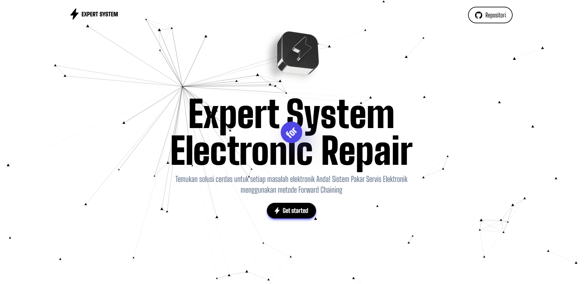
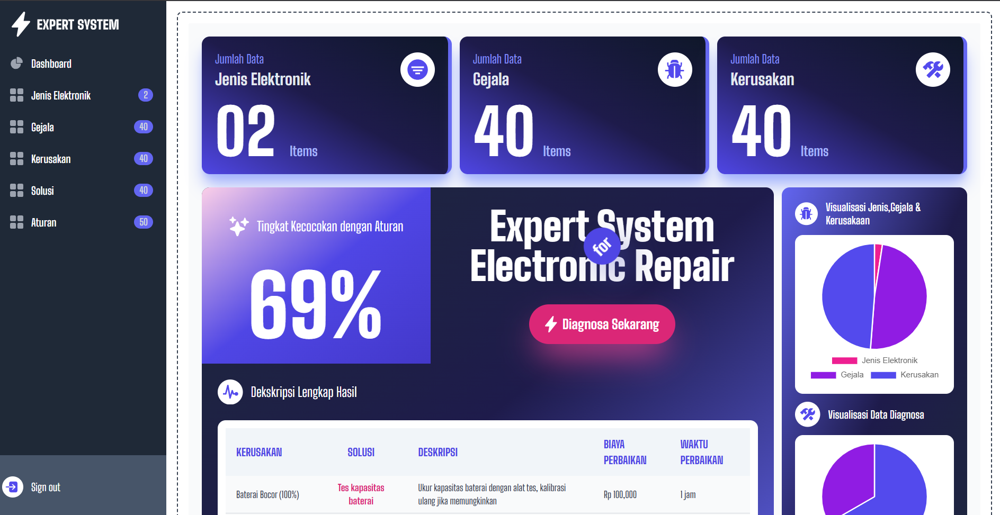

<div class="" align="center">
    <h1>SISTEM PAKAR SERVIECE ELEKTRONIK</h1>
    <span>✨⭐⭐⭐✨</span>
    <hr>
    
    
    <br>
</div>

## INSTALASI
- 📍 Pastikan sudah &nbsp;&nbsp;[Install Python (Python Official)](https://www.python.org/)
- 📍 Pastikan sudah &nbsp;&nbsp;[Install Git (git for windows)](https://git-scm.com/downloads)
- 📗&nbsp;&nbsp;Clone repository

```bash
git clone https://github.com/ENONGLOSKER/SISTEM-PAKAR-ELEKTRO.git
```
- 📁&nbsp;&nbsp;Masuk ke Folder
```bash
cd SISTEM-PAKAR-ELEKTRO
```
- 📁&nbsp;&nbsp;Install requirements
```bash
pip install -r requirement.txt
```
- 📁&nbsp;&nbsp;Run Server
```bash
python manage.py runserver
```

## cara update, jika terjadi perubahan
```bash
git pull origin master
```
<br>